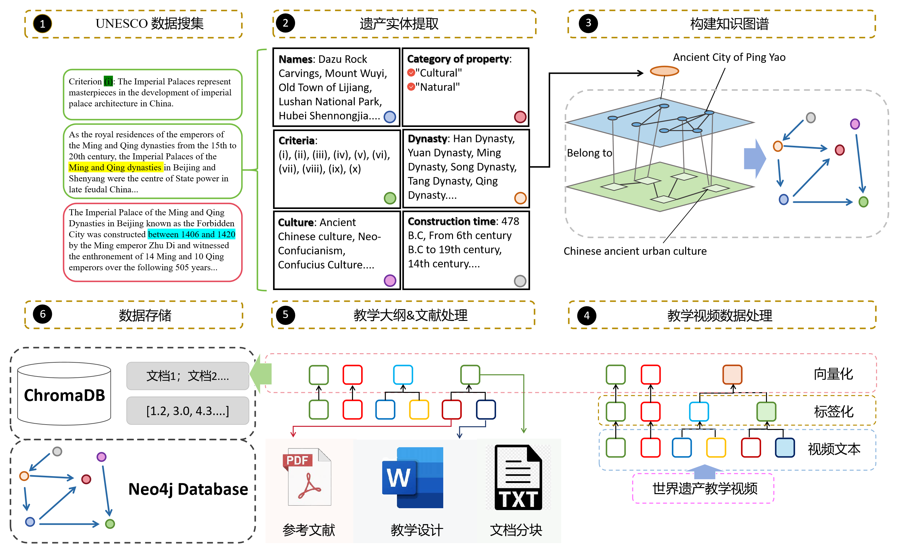
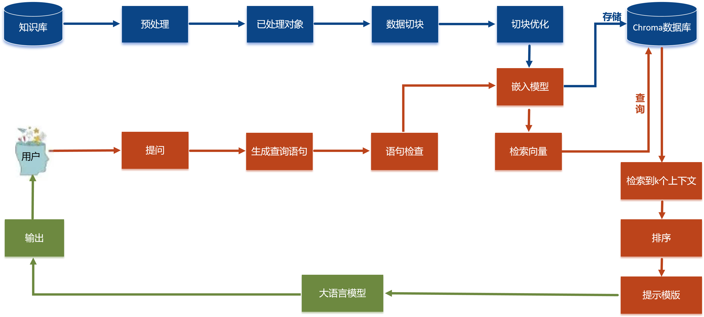
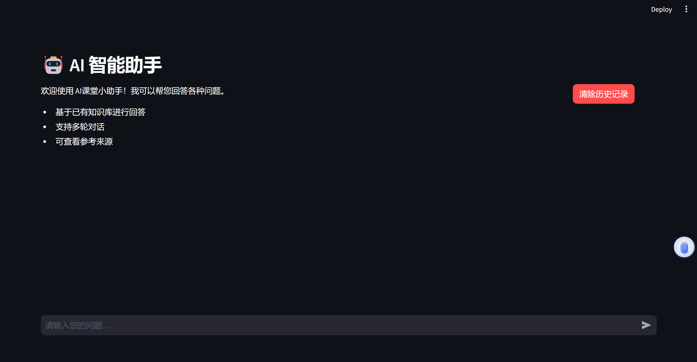
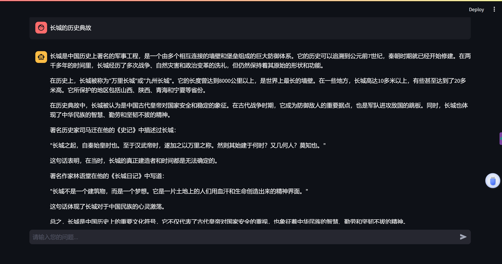
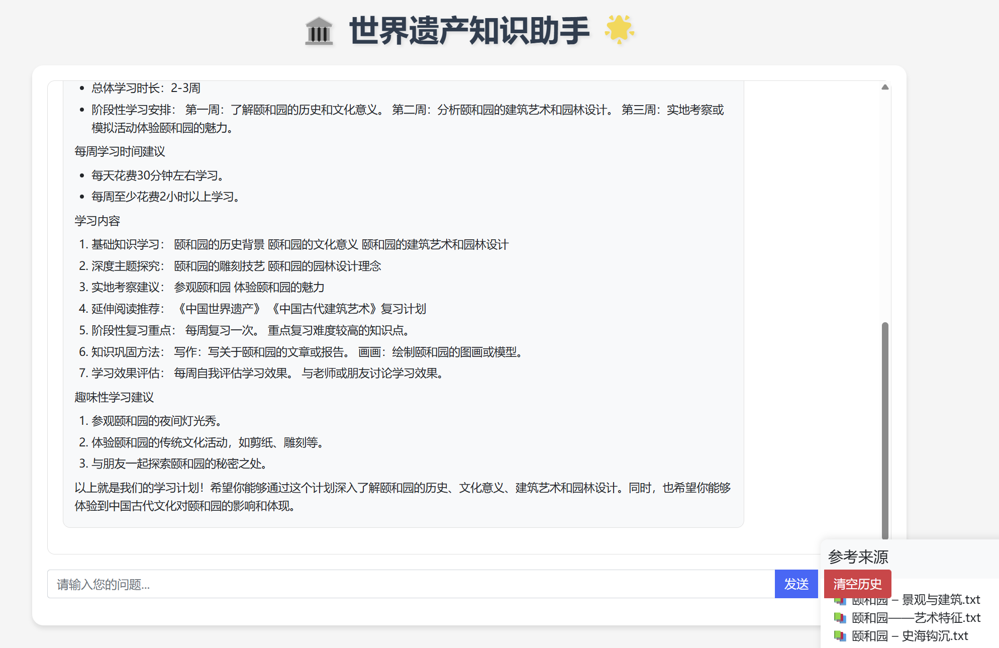
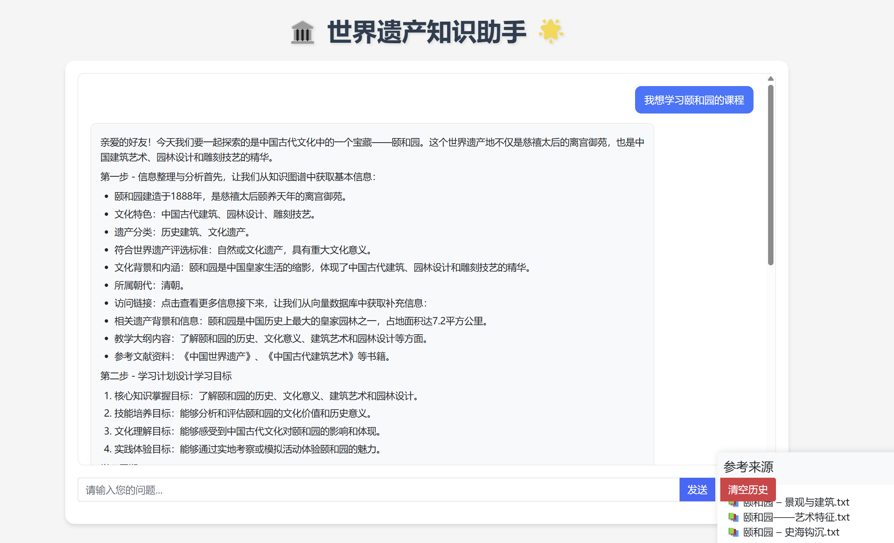

# 🤖Heritage Knowledge Assistant

An intelligent Q&A system based on Large Language Models, specifically designed to answer questions about world heritage sites. The system combines knowledge graphs and vector databases to provide accurate and detailed information about world heritage.



## System Architecture

This project utilizes RAG (Retrieval-Augmented Generation) technology, integrating Neo4j knowledge graphs and vector databases to achieve high-quality knowledge Q&A capabilities.



## Features

- Multi-turn dialogue support
- Hybrid retrieval combining knowledge graphs and vector databases
- Reference source tracing
- User-friendly interface
- Two deployment versions available

## Requirements

- Python 3.8+
- Neo4j Database
- Ollama (for local model deployment)
- FFmpeg (for audio processing)

## Installation

1. Clone the repository:
```bash
git clone [your-repository-url]
cd Heritage-graphRAG
```

2. Create and activate virtual environment (recommended):
```bash
python -m venv venv
# Windows
venv\Scripts\activate
# Linux/Mac
source venv/bin/activate
```

3. Install dependencies:
```bash
pip install -r requirements.txt
```

4. Install and start Ollama:
   - Visit [Ollama website](https://ollama.ai/) to download and install
   - Pull required models:
```bash
ollama pull llama3.1
ollama pull mxbai-embed-large
```

5. Install and configure Neo4j:
   - Download and install from [Neo4j website](https://neo4j.com/download/)
   - Create a new database and set password
   - Import world heritage knowledge graph data

## Version Information

### Version 1 (Streamlit Version)




This version is developed using the Streamlit framework, providing a clean and simple web interface.

To run:
```bash
cd streamlit_v1
streamlit run iu_chat_2.py
```

### Version 2 (Flask Version)




This is an improved version developed using the Flask framework, featuring a more aesthetic interface and additional functionality.

To run:
```bash
python web.py
```

## Configuration

1. Neo4j Configuration:
   - Default connection settings in `neo4j_query.py`
   - Default address: `bolt://localhost:7687`
   - Default username: `neo4j`
   - Please modify the password configuration

2. Vector Database Configuration:
   - Data storage path configured in `web.py` and `iu_chat_2.py`
   - Default path: `chroma_data`

## Data Processing Tools

The project provides two data processing tools:

1. Knowledge Graph Data Processing:
```bash
python graph_to_vector/graph_refined.py --persist_directory [your_directory]
```

2. Reference Material Vectorization:
```bash
python references_to_vector/vector_refined.py --persist_directory [your_directory]
```

## Important Notes

1. Before first run, ensure:
   - Neo4j database is running and data is imported
   - Ollama service is running and required models are downloaded
   - Vector database directory is properly configured

2. Troubleshooting:
   - Check Neo4j connection configuration
   - Verify Ollama service status
   - Validate vector database path

## License


## Contact

[1347959081@qq.com] 
